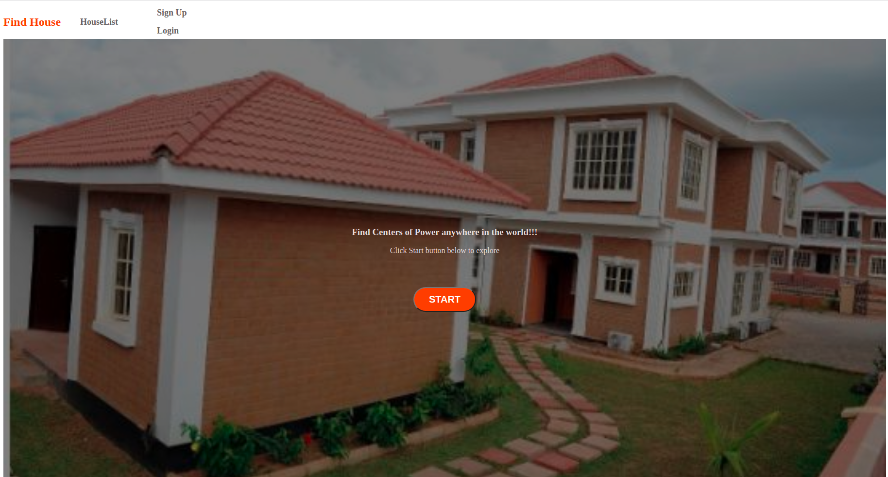
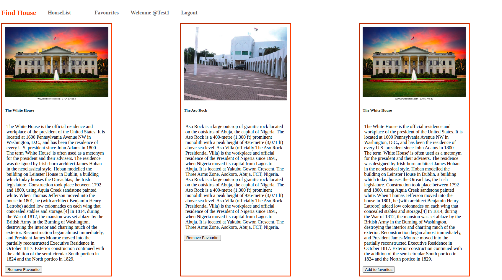

 #              LOCATE ADMINISTRATIVE HOUSES APP

> The find your administrative house App is a FullStack app built with ReactJs for the frontend and Ruby On Rails for the backEnd. When you first visit the app, you will see the homepage from where you can visit either visit the list of various government administratives houses list, Login or Sign up.
 On the House list page, a user can add some administrative houses to his favorite, by clicking the add to favorites button.
> NB: The add to the favorite button is only visible to logged-in users.

> From the favorite page, you can click on the remove favorite button to remove a particular house from your favorite list. Also, by clicking on any of the houses, you can access the details page of the house.





## Built With

- Node.js
- React
- React-DOM
- Redux
- CSS
- ES6
- npm
- Redux-persist
- Bootstrap

## Getting Started

To run this project locally, make sure you have done the following:

- Installed Node.js, more information [here](https://nodejs.org/en/)
- Installed Node package manager

- Get a copy of the project by running

```
 git clone git@github.com:Alaska01/Backend_Capstone_RoR.git

```

on your terminal..

### Setup, Installations and usage

- cd into the project
- open the project using code editor of your choice
- Run `npm install` to install all dependencies
- Run `npm start` to start the server
- Open your prefered browser
- Edit paths locally to fit the routes
- Visit `http://localhost:3000/`

## Live version

### [Live Version](https://ayecapstonefrotend.netlify.app/)

## Back-end
### [Backend Link](https://github.com/Alaska01/Backend_Capstone_RoR/tree/backend)


## RUN TEST

```
npm test

```

## Authors

👨‍💻 **Aye Daniel Asoo**

- Github: [@Alaska01](https://github.com/Alaska01)
-  Twitter: [@AyeAsoo](https://twitter.com/AyeAsoo)
- LinkedIn: [LinkedIn](https://www.linkedin.com/in/daniel-asoo-aye/)

## 🤝 Contributing

Contributions, issues, and feature requests are welcome!

Feel free to check the [issues page](https://github.com/Alaska01/Frontend_Capstone_React/issues).

## Acknowledgements

[Microverse](https://www.microverse.org/)

[Alexey Savitskiy on Behance](https://www.behance.net/alexey_savitskiy)

## Show your support

Give a ⭐️ if you like this project!

## 📝 License

This project is [MIT](https://github.com/stevenvachon/broken-link-checker/blob/main/license) licensed.